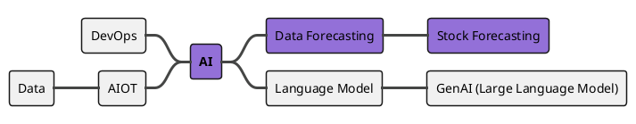

# PlantUML 匯入與淘汰路徑

**PlantUML 不是本技能的輸出格式**，只是匯入來源。目的：使用者現有的 `.puml`/`.planuml` 圖表（用 skinparam 硬調、樣式受限、長得像預設樣板）要被改畫成原生 HTML+SVG，套用 `style-guide.md` 的克制美學，然後**移除**原本依賴外部 PlantUML 渲染伺服器的嵌入方式。完成遷移後，`.planuml` 來源檔可以留著當歷史記錄，但文件裡實際嵌入的圖要換成新產出的 SVG。

## 已知案例：`InvestmentStackVision.planuml`

來源（`mkdocs-investment/docs/InvestmentStackVision.planuml`）：



目前的嵌入方式（要被取代）：

```markdown
<figure markdown="span">
  
  <figcaption>Figure 1 Investment Stack Vision</figcaption>
</figure>
```

問題：每次頁面載入都要打外部公開伺服器渲染；視覺完全是 PlantUML 預設樣板（`!theme toy`），跟 `style-guide.md` 的克制美學無關，也無法精細控制節點造型。

## 遷移流程

1. **解析**：用 `scripts/import_plantuml_mindmap.py` 把 `.planuml` 的 mindmap 語法（`+`/`-` 深度符號、`[#顏色]`、`**粗體**`）解析成中繼格式（IR，JSON），不靠正規表達式硬猜語意。
   ```bash
   python scripts/import_plantuml_mindmap.py InvestmentStackVision.planuml --out InvestmentStackVision.ir.json
   ```
2. **改畫**：讀 IR，依 `diagram-types.md` 的 mindmap 規格與 `style-guide.md` 的色彩/字型/密度規則，手刻原生 HTML+SVG（例如 `InvestmentStackVision.html`）。IR 中原本標記 `[#MediumPurple]` 的節點，對應到新版的單一 accent color（`style-guide.md` 的 `accent` token），其餘節點用中性色，不要整份圖沿用 PlantUML 的多色 `!theme toy`。
3. **輸出**：依 `output-spec.md` 轉出目標平台需要的格式（Docsify/MkDocs 用 SVG，PowerPoint 用 `scripts/svg_to_png.py` 轉 PNG）。
4. **替換嵌入**：把文件裡的 PlantUML proxy `<figure>` 區塊換成新 SVG 的 `<figure>` 區塊，路徑指到本地存放的 SVG（例如 `docs/assets/diagrams/investment-stack-vision.svg`），不再指向 `plantuml.com`。
5. **保留來源檔（選用）**：`.planuml` 檔案可以留在 repo 當作「這張圖曾經的定義」，但不再被任何頁面引用渲染；若確定不需要，直接刪除即可（不是本技能的職責，由使用者決定）。

## `scripts/import_plantuml_mindmap.py`

只解析 PlantUML **mindmap** 語法（`@startmindmap` ... `@endmindmap`），這是目前唯一有實際案例的類型。其他 PlantUML 圖（sequence、class、gantt……）如果之後有匯入需求，比照這支腳本的模式另外實作解析器，一樣輸出到共通 IR 格式再手刻 SVG，不要直接把該圖的 PlantUML 語法當輸出保留。

IR 格式（節錄 `InvestmentStackVision.planuml` 的解析結果）：

```json
{
  "type": "mindmap",
  "root": {
    "text": "AI",
    "bold": true,
    "color": "MediumPurple",
    "side": "right",
    "children": [
      {
        "text": "Data Forecasting",
        "color": "MediumPurple",
        "side": "right",
        "children": [
          {"text": "Stock Forecasting", "color": "MediumPurple", "side": "right", "children": []}
        ]
      },
      {
        "text": "Language Model",
        "color": null,
        "side": "right",
        "children": [
          {"text": "GenAI (Large Language Model)", "color": null, "side": "right", "children": []}
        ]
      },
      {
        "text": "DevOps",
        "color": null,
        "side": "left",
        "children": []
      },
      {
        "text": "AIOT",
        "color": null,
        "side": "left",
        "children": [
          {"text": "Data", "color": null, "side": "left", "children": []}
        ]
      }
    ]
  }
}
```

說明：`+` 開頭的節點畫在右側、`-` 開頭的畫在左側（PlantUML mindmap 的慣例），深度由連續 `+`/`-` 的數量決定；`side` 欄位保留這個左右分佈語意，讓後續手刻 SVG 時維持原圖的視覺配置習慣（除非使用者要求改版型）。

## 什麼時候還會用到「渲染」而不是「匯入」

只有一種情境：使用者想先看一眼「原始 PlantUML 現在長怎樣」以便對照遷移前後差異。這時可以用一次性指令直接打公開伺服器渲染舊檔，**僅供比對，不作為最終輸出**：

```bash
python scripts/render_plantuml.py fetch InvestmentStackVision.planuml --fmt png --out /tmp/before.png
```

（此指令的 hex 編碼細節與本地 `plantuml.jar` fallback，見 `scripts/render_plantuml.py` 檔頭註解。）遷移完成後這個比對用途也就用不到了。
